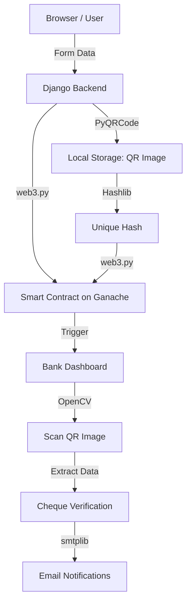

Ran command: `truffle migrate`
Ran command: `cd ..`

This is a comprehensive technical breakdown of the **BlockCheque** application. It combines everything we have discussed—from the local setup to the complex logic of QR codes and Smart Contracts.

---

### 1. The Technology Stack (Tools & Libraries)

To run this application, three distinct environments work together:

| Layer | Primary Tool | Key Libraries | Role |
| :--- | :--- | :--- | :--- |
| **Web Server** | **Django** (Python) | `web3.py`, `cv2` (OpenCV), `PyQRCode`, `smtplib` | Handles the UI, processes images, sends emails, and talks to the blockchain. |
| **Blockchain** | **Ganache** | **Solidity** (`Cheque.sol`) | The "Immutable Database" where all users and cheque records are permanently stored. |
| **DevOps/Deployment**| **Truffle** | Node.js | Compiles the Solidity code and "Migrates" (deploys) it onto the Ganache network. |

---

### 2. The Architectural Flow
Here is how the data moves through the system when you interact with the app:

---

### 3. Deep Dive: The Step-by-Step Lifecycle

#### Step 1: Registration & Storage
*   **Action:** A user or bank registers via a web form.
*   **Technical Detail:** Django receives the data and uses **`web3.py`** to call the `createUser` function in the **Solidity** contract. 
*   **Blockchain Role:** The contract creates a `user` **Struct** and saves it in a **Mapping**. This is permanent; once registered, the user exists in the "ledger" of Ganache.

#### Step 2: Cheque Generation (The Visual Digital Asset)
*   **Action:** A user creates a cheque for someone else.
*   **Technical Detail:** 
    1.  **`PyQRCode`** generates a `.png` file containing the data string (`Sender#Bank#Receiver#Amount#Date`).
    2.  **`hashlib`** calculates a SHA-256 hash of that image file.
    3.  **`web3.py`** sends only the **QR Hash** and the status ("Pending") to the blockchain.
*   **Significance:** The blockchain doesn't store the image (which is heavy); it stores the "fingerprint" (the Hash). This ensures that if the image is altered by even one pixel, the fingerprint won't match anymore.

#### Step 3: Bank Verification (Computer Vision)
*   **Action:** The Bank logs in to view pending cheques.
*   **Technical Detail:** 
    1.  The app pulls the list of cheque hashes from the blockchain.
    2.  For each hash, it uses **`OpenCV` (cv2)** to open the corresponding QR image file.
    3.  `OpenCV` decodes the pixels back into a string so the Bank can see the details (e.g., "$500 to Bob") on their screen.

#### Step 4: Clearance & Notification
*   **Action:** The Bank clicks "Clear Cheque."
*   **Technical Detail:** 
    1.  The `updateStatus` function in the **Solidity** contract is called to change "Pending" to "Cleared."
    2.  Django looks up the email addresses of the sender and receiver from the blockchain.
    3.  **`smtplib`** connects to Gmail's SMTP server and sends out the confirmation alerts. 
    *(Note: We found a minor bug here where the second email is sent back to the sender instead of the receiver!)*

---

### 4. What is actually on the Blockchain?
Unlike a standard app that stores everything in a database, this app splits the data:

*   **ON the Blockchain (Ganache):**
    *   The `userCount` and `chequeCount`.
    *   User credentials (Username, Email, etc.).
    *   The **Status** of each cheque (Pending/Cleared).
    *   The **Hash** of the QR code image.
*   **OFF the Blockchain (Local Files):**
    *   The actual `.png` image files of the QR codes.
    *   The Django HTML templates.
    *   The Python logic for OpenCV and Email.

### 5. Summary of Roles
*   **Django** is the **Brain** (Logic & UI).
*   **Web3.py** is the **Mouth** (Communicating with the blockchain).
*   **Solidity** is the **Memory** (Secure, permanent storage).
*   **OpenCV** is the **Eyes** (Reading the QR codes).
*   **Ganache** is the **World** (The environment where everything exists).

This architecture provides a "Trustless" system. The Bank doesn't have to trust the User's word; they trust the **OpenCV** scan and the **Blockchain** hash verification!